# 🌐 Networking Fundamentals: OSI & TCP/IP Models

> **Day 1 Session - MLOps Foundation Series**  
> Understanding network communication layers for cloud infrastructure

---

## 📚 Table of Contents

1. [Why Networking Matters for MLOps](#why-networking-matters-for-mlops)
2. [The OSI Model (7 Layers)](#the-osi-model-7-layers)
3. [The TCP/IP Model (5 Layers)](#the-tcpip-model-5-layers)
4. [OSI vs TCP/IP Comparison](#osi-vs-tcpip-comparison)
5. [Deep Dive: Each Layer](#deep-dive-each-layer)
6. [Common Protocols](#common-protocols)
7. [Practical Examples](#practical-examples)
8. [Networking Commands](#networking-commands)
9. [Troubleshooting Guide](#troubleshooting-guide)
10. [Resources](#resources)

---

## Why Networking Matters for MLOps


Understanding networking is essential for MLOps because:

- **Model Deployment**: APIs, load balancers, and service meshes
- **Data Pipelines**: Secure data transfer between services
- **Cloud Infrastructure**: VPCs, subnets, security groups
- **Debugging**: Identifying connectivity issues
- **Security**: Firewalls, encryption, access control

---

## The OSI Model (7 Layers)

The **Open Systems Interconnection (OSI)** model is a conceptual framework that standardizes network communication into seven distinct layers.

### Complete OSI Stack

```mermaid
flowchart TB
    subgraph OSI["OSI Model - 7 Layers"]
        direction TB
        L7["Layer 7: Application<br/>🖥️ HTTP, FTP, SMTP, DNS"]
        L6["Layer 6: Presentation<br/>🔐 SSL/TLS, JPEG, ASCII"]
        L5["Layer 5: Session<br/>🤝 NetBIOS, RPC"]
        L4["Layer 4: Transport<br/>📦 TCP, UDP"]
        L3["Layer 3: Network<br/>🗺️ IP, ICMP, Routers"]
        L2["Layer 2: Data Link<br/>🔗 Ethernet, MAC, Switches"]
        L1["Layer 1: Physical<br/>⚡ Cables, Hubs, Signals"]
        
        L7 --> L6
        L6 --> L5
        L5 --> L4
        L4 --> L3
        L3 --> L2
        L2 --> L1
    end
    
    style L7 fill:#ffebee,stroke:#c62828
    style L6 fill:#fff3e0,stroke:#e65100
    style L5 fill:#fff8e1,stroke:#f9a825
    style L4 fill:#e8f5e9,stroke:#2e7d32
    style L3 fill:#e3f2fd,stroke:#1565c0
    style L2 fill:#e1f5fe,stroke:#0277bd
    style L1 fill:#f3e5f5,stroke:#7b1fa2
```



### Memory Trick 🧠

**Top to Bottom (Layer 7 → 1):**
> "**A**ll **P**eople **S**eem **T**o **N**eed **D**ata **P**rocessing"

**Bottom to Top (Layer 1 → 7):**
> "**P**lease **D**o **N**ot **T**hrow **S**ausage **P**izza **A**way"

### Quick Reference Table

| Layer | Name         | Function                          | Data Unit   | Devices              | Protocols            |
|-------|--------------|-----------------------------------|-------------|----------------------|----------------------|
| 7     | Application  | User interface & network services | Data        | Firewalls            | HTTP, FTP, SMTP, DNS |
| 6     | Presentation | Data formatting & encryption      | Data        | -                    | SSL/TLS, JPEG, ASCII |
| 5     | Session      | Connection management             | Data        | -                    | NetBIOS, RPC         |
| 4     | Transport    | End-to-end delivery               | Segment     | Load Balancers       | TCP, UDP             |
| 3     | Network      | Routing & addressing              | Packet      | Routers              | IP, ICMP, ARP        |
| 2     | Data Link    | Node-to-node delivery             | Frame       | Switches, Bridges    | Ethernet, PPP, MAC   |
| 1     | Physical     | Physical transmission             | Bits        | Hubs, Cables, NICs   | USB, DSL, Bluetooth  |

---

## The TCP/IP Model (5 Layers)

The **TCP/IP model** (also called the Internet Protocol Suite) is the practical model used by the modern Internet. While theoretically 4 layers, the **5-layer model** is commonly taught as it separates Physical and Data Link layers for clarity.

### TCP/IP 5-Layer Stack

```mermaid
flowchart TB
    subgraph TCPIP["TCP/IP Model - 5 Layers"]
        direction TB
        T5["Layer 5: Application<br/>🖥️ HTTP, FTP, SMTP, DNS, SSH"]
        T4["Layer 4: Transport<br/>📦 TCP, UDP"]
        T3["Layer 3: Network/Internet<br/>🗺️ IP, ICMP, ARP"]
        T2["Layer 2: Data Link<br/>🔗 Ethernet, Wi-Fi, MAC"]
        T1["Layer 1: Physical<br/>⚡ Cables, Signals, Hardware"]
        
        T5 --> T4
        T4 --> T3
        T3 --> T2
        T2 --> T1
    end
    
    style T5 fill:#ffebee,stroke:#c62828
    style T4 fill:#e8f5e9,stroke:#2e7d32
    style T3 fill:#e3f2fd,stroke:#1565c0
    style T2 fill:#e1f5fe,stroke:#0277bd
    style T1 fill:#f3e5f5,stroke:#7b1fa2
```



### TCP/IP Layer Details

| Layer | Name        | Function                                     | Key Protocols                    |
|-------|-------------|----------------------------------------------|----------------------------------|
| 5     | Application | Application-level protocols & user services  | HTTP, HTTPS, FTP, SSH, DNS, SMTP |
| 4     | Transport   | Process-to-process delivery                  | TCP, UDP                         |
| 3     | Network     | Host-to-host delivery & routing              | IP (IPv4, IPv6), ICMP, ARP       |
| 2     | Data Link   | Node-to-node delivery on same network        | Ethernet, Wi-Fi, MAC addresses   |
| 1     | Physical    | Physical signal transmission                 | Cables, Radio waves, Fiber       |

---

## OSI vs TCP/IP Comparison

### Side-by-Side Comparison


### Key Differences

| Aspect              | OSI Model                          | TCP/IP Model                      |
|---------------------|------------------------------------|------------------------------------|
| **Layers**          | 7 layers                           | 5 layers (or 4 in some versions)   |
| **Development**     | ISO standard (theoretical)         | DARPA/DoD (practical)              |
| **Approach**        | Protocol-independent reference     | Protocol-specific implementation   |
| **Usage**           | Teaching & reference               | Real-world Internet                |
| **Session/Present** | Separate layers                    | Combined into Application          |
| **Flexibility**     | More detailed separation           | Simpler, practical approach        |

### Why Both Matter


**Use OSI for:**
- Learning networking concepts
- Troubleshooting (isolate which layer has issues)
- Communication with vendors
- Certification exams (CCNA, CompTIA)

**Use TCP/IP for:**
- Actual network implementation
- Understanding Internet protocols
- Working with cloud infrastructure
- Day-to-day operations

---

## Deep Dive: Each Layer

### Layer 1: Physical Layer ⚡


**What it does:**
- Transmits raw **bits** (0s and 1s) over physical media
- Defines electrical, optical, and radio specifications
- Handles cable types, connectors, voltage levels

**Key Concepts:**
- **Bandwidth**: Data transfer capacity (Mbps, Gbps)
- **Throughput**: Actual data transferred
- **Latency**: Time for data to travel

**Technologies:**
- Ethernet cables (Cat5e, Cat6, Cat7)
- Fiber optic (single-mode, multi-mode)
- Wi-Fi (802.11a/b/g/n/ac/ax)
- Bluetooth, DSL, USB

---

### Layer 2: Data Link Layer 🔗


**What it does:**
- Provides **node-to-node** data transfer on same network
- Handles **MAC addresses** (hardware addresses)
- Error detection and correction

**Key Concepts:**
- **MAC Address**: 48-bit hardware identifier (e.g., `AA:BB:CC:DD:EE:FF`)
- **Frame**: Data unit at this layer
- **ARP**: Maps IP addresses to MAC addresses

**Technologies:**
- Ethernet (802.3)
- Wi-Fi (802.11)
- PPP (Point-to-Point Protocol)
- Switches, Bridges

---

### Layer 3: Network Layer 🗺️


**What it does:**
- **Logical addressing** using IP addresses
- **Routing** packets between different networks
- **Path determination** (finding best route)

**Key Concepts:**
- **IP Address**: Logical address (IPv4: `192.168.1.1`, IPv6: `2001:db8::1`)
- **Subnet**: Network subdivision (e.g., `/24` = 255.255.255.0)
- **Packet**: Data unit at this layer

**Protocols:**
- **IP (Internet Protocol)**: Addressing and routing
- **ICMP**: Error messages and diagnostics (ping)
- **ARP**: Address Resolution Protocol

**IP Address Classes (IPv4):**

| Class | Range                     | Default Mask    | Purpose          |
|-------|---------------------------|-----------------|------------------|
| A     | 1.0.0.0 - 126.255.255.255 | 255.0.0.0       | Large networks   |
| B     | 128.0.0.0 - 191.255.255.255| 255.255.0.0    | Medium networks  |
| C     | 192.0.0.0 - 223.255.255.255| 255.255.255.0  | Small networks   |

**Private IP Ranges:**
- `10.0.0.0/8` (Class A)
- `172.16.0.0/12` (Class B)
- `192.168.0.0/16` (Class C)

---

### Layer 4: Transport Layer 📦


**What it does:**
- **End-to-end** communication between processes
- **Port numbers** identify applications
- **Flow control** and **error recovery**

**TCP vs UDP:**


**TCP 3-Way Handshake:**


**Common Port Numbers:**

| Port  | Protocol | Service              |
|-------|----------|----------------------|
| 20/21 | TCP      | FTP (data/control)   |
| 22    | TCP      | SSH                  |
| 23    | TCP      | Telnet               |
| 25    | TCP      | SMTP (email)         |
| 53    | TCP/UDP  | DNS                  |
| 80    | TCP      | HTTP                 |
| 443   | TCP      | HTTPS                |
| 3306  | TCP      | MySQL                |
| 5432  | TCP      | PostgreSQL           |
| 6379  | TCP      | Redis                |
| 8080  | TCP      | HTTP Alternate       |
| 27017 | TCP      | MongoDB              |

---

### Layer 5: Session Layer (OSI Only) 🤝

**What it does:**
- Establishes, manages, and terminates **sessions**
- Handles **authentication** and **reconnection**
- Synchronization and checkpoints

**Examples:**
- NetBIOS
- RPC (Remote Procedure Call)
- SQL sessions

> **Note:** In TCP/IP, this functionality is handled by the Application layer or TCP itself.

---

### Layer 6: Presentation Layer (OSI Only) 🔐

**What it does:**
- **Data translation** between formats
- **Encryption/Decryption**
- **Compression**

**Examples:**
- SSL/TLS encryption
- JPEG, PNG, GIF (images)
- ASCII, Unicode (text encoding)
- MPEG (video)

> **Note:** In TCP/IP, applications handle their own data formatting.

---

### Layer 7: Application Layer 🖥️


**What it does:**
- Provides **network services** to applications
- **User interface** to network functions
- Handles application-specific protocols

**Key Protocols:**

| Protocol | Port | Purpose                          |
|----------|------|----------------------------------|
| HTTP     | 80   | Web page transfer                |
| HTTPS    | 443  | Secure web transfer              |
| FTP      | 21   | File transfer                    |
| SSH      | 22   | Secure remote access             |
| DNS      | 53   | Domain name resolution           |
| SMTP     | 25   | Send email                       |
| IMAP     | 143  | Retrieve email (keeps on server) |
| POP3     | 110  | Retrieve email (downloads)       |
| DHCP     | 67/68| Automatic IP assignment          |

---

## Common Protocols

### HTTP/HTTPS Request Flow


### DNS Resolution Process


---

## Practical Examples

### Data Flow Through Layers

```mermaid
flowchart TD
    subgraph "Sending Data"
        A1["Application Layer<br/>HTTP Request"] -->|"+ HTTP Headers"| A2["Data"]
        A2 --> B["Transport Layer<br/>TCP Segment"] -->|"+ Port Numbers"| B2["Segment"]
        B2 --> C["Network Layer<br/>IP Packet"] -->|"+ IP Addresses"| C2["Packet"]
        C2 --> D["Data Link Layer<br/>Ethernet Frame"] -->|"+ MAC Addresses"| D2["Frame"]
        D2 --> E["Physical Layer<br/>Bits"] -->|"Electrical Signals"| E2["0101101..."]
    end
    
    E2 -->|"Transmitted over network"| F["Receiving Device"]
    
    subgraph "Receiving Data"
        F --> G["Physical → Data Link → Network → Transport → Application"]
        G --> H["Original Data Extracted"]
    end
    
    style A1 fill:#ffebee
    style B fill:#e8f5e9
    style C fill:#e3f2fd
    style D fill:#e1f5fe
    style E fill:#f3e5f5
```



### Encapsulation Example

When you send a web request, each layer adds its own header:

```
┌─────────────────────────────────────────────────────────────────┐
│                    Ethernet Frame                                │
│ ┌─────────────────────────────────────────────────────────────┐ │
│ │                      IP Packet                               │ │
│ │ ┌─────────────────────────────────────────────────────────┐ │ │
│ │ │                   TCP Segment                            │ │ │
│ │ │ ┌─────────────────────────────────────────────────────┐ │ │ │
│ │ │ │                 HTTP Data                            │ │ │ │
│ │ │ │          "GET /index.html HTTP/1.1"                 │ │ │ │
│ │ │ └─────────────────────────────────────────────────────┘ │ │ │
│ │ │  TCP Header (ports: 52431 → 80)                         │ │ │
│ │ └─────────────────────────────────────────────────────────┘ │ │
│ │  IP Header (192.168.1.100 → 93.184.216.34)                  │ │
│ └─────────────────────────────────────────────────────────────┘ │
│  Ethernet Header (MAC addresses) + Trailer (CRC)                │
└─────────────────────────────────────────────────────────────────┘
```

### Real-World Example: API Request


---

## Networking Commands

### Essential Commands for Each Layer

```bash
# Layer 1 - Physical
ip link show                    # Show network interfaces
ethtool eth0                    # Interface details & speed
iwconfig                        # Wireless interface info

# Layer 2 - Data Link
arp -a                          # Show ARP cache (MAC addresses)
ip neighbor show                # Same as arp -a (modern)
bridge link show                # Show bridge links

# Layer 3 - Network
ip addr show                    # Show IP addresses
ip route show                   # Show routing table
ping 8.8.8.8                    # Test connectivity
traceroute google.com           # Trace packet path
mtr google.com                  # Better traceroute

# Layer 4 - Transport
netstat -tuln                   # Show listening ports
ss -tuln                        # Modern netstat
nc -zv host 80                  # Test port connectivity
nmap -p 1-1000 host             # Port scanning

# Layer 7 - Application
curl -v https://api.example.com # HTTP request with details
dig google.com                  # DNS lookup
nslookup google.com             # DNS lookup (simpler)
host google.com                 # DNS lookup (simplest)
wget https://example.com/file   # Download file
```

### Troubleshooting Workflow


### Network Diagnostic Script

```bash
#!/bin/bash
# Network Diagnostic Script

echo "🔍 Network Diagnostics"
echo "======================"

# Check interfaces
echo ""
echo "📡 Network Interfaces:"
ip addr show | grep -E "^[0-9]+:|inet "

# Check gateway
echo ""
echo "🚪 Default Gateway:"
ip route | grep default

# Test local connectivity
echo ""
echo "🏠 Local Connectivity (localhost):"
ping -c 1 127.0.0.1 > /dev/null && echo "✅ OK" || echo "❌ Failed"

# Test gateway connectivity
gateway=$(ip route | grep default | awk '{print $3}')
if [ -n "$gateway" ]; then
    echo ""
    echo "🔗 Gateway Connectivity ($gateway):"
    ping -c 1 $gateway > /dev/null && echo "✅ OK" || echo "❌ Failed"
fi

# Test external connectivity
echo ""
echo "🌐 External Connectivity (8.8.8.8):"
ping -c 1 8.8.8.8 > /dev/null && echo "✅ OK" || echo "❌ Failed"

# Test DNS
echo ""
echo "📖 DNS Resolution (google.com):"
host google.com > /dev/null 2>&1 && echo "✅ OK" || echo "❌ Failed"

# Check listening ports
echo ""
echo "🚀 Listening Ports:"
ss -tuln | head -10

echo ""
echo "======================"
echo "Diagnostics complete!"
```

---

## Troubleshooting Guide

### Common Issues by Layer


### Quick Troubleshooting Reference

| Symptom                     | Possible Layer | Check                                    |
|-----------------------------|----------------|------------------------------------------|
| No link light               | 1              | Cable, port, NIC                         |
| Can't reach local devices   | 2              | MAC address, switch, VLAN                |
| Can't reach other networks  | 3              | IP address, subnet, gateway, routing     |
| Connection refused          | 4              | Port, firewall, service status           |
| Timeout on specific service | 4-7            | Service running, firewall, DNS           |
| SSL/TLS errors              | 7              | Certificate, date/time, cipher suite     |
| DNS not resolving           | 7              | DNS server, `/etc/resolv.conf`           |

---

## Resources

### 📖 Official Documentation

- [RFC 1122 - Internet Host Requirements](https://tools.ietf.org/html/rfc1122)
- [RFC 791 - Internet Protocol](https://tools.ietf.org/html/rfc791)
- [RFC 793 - Transmission Control Protocol](https://tools.ietf.org/html/rfc793)

### 🎓 Learning Resources

- [GeeksforGeeks - OSI vs TCP/IP Model](https://www.geeksforgeeks.org/difference-between-osi-model-and-tcp-ip-model/) ⭐
- [Computer Networking Notes - OSI Model Explained](https://www.computernetworkingnotes.com/ccna-study-guide/osi-seven-layers-model-explained-with-examples.html)
- [freeCodeCamp - TCP/IP Layers Explained](https://www.freecodecamp.org/news/what-is-tcp-ip-layers-and-protocols-explained/)
- [JMU - Five Layer Model](https://w3.cs.jmu.edu/kirkpams/OpenCSF/Books/csf/html/FiveLayer.html)

### 🔧 Interactive Tools

- [Subnet Calculator](https://www.subnet-calculator.com/)
- [Wireshark](https://www.wireshark.org/) - Packet analyzer
- [Nmap](https://nmap.org/) - Network scanner
- [Postman](https://www.postman.com/) - API testing

### 📚 Recommended Books

- *Computer Networking: A Top-Down Approach* by Kurose & Ross
- *TCP/IP Illustrated* by W. Richard Stevens
- *Network Warrior* by Gary A. Donahue

### 🎥 Video Resources

- [Network Direction (YouTube)](https://www.youtube.com/c/NetworkDirection)
- [Professor Messer - Network+](https://www.professormesser.com/network-plus/)
- [Practical Networking (YouTube)](https://www.youtube.com/c/PracticalNetworking)

### ☁️ Cloud-Specific Networking

- [AWS Networking Documentation](https://docs.aws.amazon.com/vpc/)
- [GCP Networking Overview](https://cloud.google.com/vpc/docs)
- [Azure Networking Documentation](https://docs.microsoft.com/en-us/azure/networking/)

---

## Quick Reference Card

### OSI Model Summary

```
Layer 7 (Application)   → What the user sees (HTTP, FTP, DNS)
Layer 6 (Presentation)  → Data formatting (SSL, JPEG)
Layer 5 (Session)       → Connection management (sessions)
Layer 4 (Transport)     → End-to-end delivery (TCP, UDP) [Ports]
Layer 3 (Network)       → Routing between networks (IP) [IP Addresses]
Layer 2 (Data Link)     → Same network delivery (Ethernet) [MAC Addresses]
Layer 1 (Physical)      → Physical transmission (Cables, Signals)
```

### TCP/IP Model Summary

```
Layer 5 (Application)   → HTTP, FTP, SSH, DNS, SMTP
Layer 4 (Transport)     → TCP (reliable), UDP (fast)
Layer 3 (Network)       → IP addressing and routing
Layer 2 (Data Link)     → MAC addresses, Ethernet
Layer 1 (Physical)      → Cables, wireless, signals
```

### Essential Ports

```
22   SSH          443  HTTPS       5432 PostgreSQL
25   SMTP         3306 MySQL       6379 Redis
53   DNS          5000 Flask       8080 HTTP Alt
80   HTTP         27017 MongoDB    9090 Prometheus
```

---

> **Next Session:** Cloud Networking with AWS VPCs  
> **Author:** MLOps Foundation Series  
> **Last Updated:** January 2026
